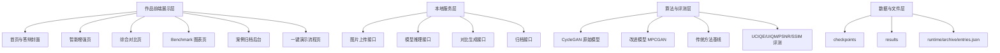
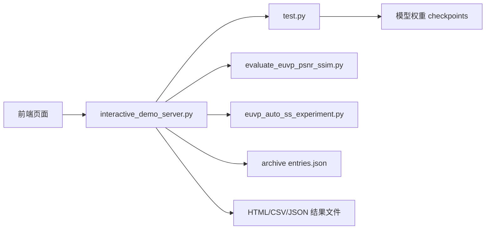
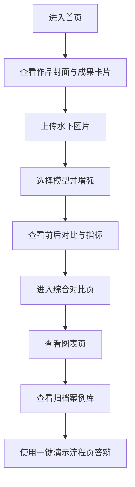

# 海眸智澈：面向水下机器人视觉任务的智能图像增强平台

## 第一章 需求分析

水下图像普遍存在偏色、低对比、散射模糊和细节丢失等问题，直接影响海洋监测、水下巡检、ROV/AUV 视觉识别和生态调查的可用性。现有研究型算法往往只关注离线实验指标，不具备竞赛答辩所需的交互展示、方案对比、结果归档与可视化分析能力。因此，本作品的开发目标不是仅实现“增强算法”，而是构建一个集**图像增强、方法对比、指标评测、案例归档、答辩展示**于一体的完整系统。

本作品面向三类用户：一是参加人工智能应用或软件应用与开发赛道的参赛团队；二是需要进行水下图像预处理的科研与工程人员；三是希望快速演示视觉增强效果的教师、评委与答辩观众。系统的核心需求包括：支持上传水下图片并实时增强；支持切换原始 CycleGAN 与改进模型；支持传统方法、原始模型、改进模型的统一对比；支持生成报告、图表页与案例归档页；支持现场答辩时的一键演示流程。

从竞品角度看，当前同类作品主要分为两类：一类是传统增强工具，操作简单但对水下复杂退化适应性有限；另一类是 WaterNet、UColor、FUnIE-GAN 等偏研究型模型，强调算法性能但通常缺乏完整演示系统。本作品对标的不是单一算法，而是“**算法 + 系统 + 展示 + 竞赛表达**”的完整作品形态。

### 竞品分析表

| 对比维度 | 传统图像增强工具 | 研究型水下增强模型 | 本作品 |
| --- | --- | --- | --- |
| 核心能力 | 调亮度、对比度、白平衡 | 侧重增强模型效果 | 增强、对比、评测、归档、演示一体化 |
| 水下场景针对性 | 一般 | 强 | 强 |
| 交互演示 | 弱 | 弱 | 强 |
| 多方案对比 | 弱 | 一般 | 强 |
| 指标可视化 | 弱 | 一般 | 强 |
| 答辩表达能力 | 弱 | 一般 | 强 |
| 部署方式 | 本地工具 | 研究代码居多 | 本地 Web 演示系统 |

### 主要功能与性能目标

| 类别 | 内容 |
| --- | --- |
| 主要功能 | 单图增强、模型切换、综合对比、报告生成、图表分析、案例归档、一键演示 |
| 主要性能 | 单图增强响应稳定；前端交互流畅；本地部署简单；结果可复现；界面适合比赛展示 |
| 面向用户 | 参赛团队、科研人员、评委与答辩观众 |

---

## 第二章 概要设计

本作品总体采用“**本地 Web 前端 + Python 推理服务 + 结果文件归档**”的结构。系统既保留原有 CycleGAN 训练与测试主干，又在其上构建面向比赛展示的交互式应用层。

### 2.1 功能模块划分



### 2.2 模块层次与调用关系



### 2.3 人机界面设计

- 首页：展示作品定位、动态标题、成果卡片、封面主图与系统入口
- 智能增强页：上传图片、切换模型、拖拽对比、下载结果、导出答辩截图
- 综合对比页：传统方法、原始 CycleGAN、改进模型的统一对照
- 图表页：展示 PSNR、SSIM、UCIQE、UIQM 的可视化分析
- 归档页：展示案例库，支持筛选、排序、置顶与展开详情
- 演示流程页：按照答辩顺序串联所有关键页面

---

## 第三章 详细设计

### 3.1 界面设计

本作品界面采用深色科技风设计，强调“答辩展示感、产品感、可信度”。首页加入动态光晕、浮动卡片、数字跃迁和封面视觉主图，用于增强第一视觉冲击力；归档页采用案例运营后台风格，突出案例管理与重点案例置顶；图表页强调数据支撑；演示流程页强调答辩节奏控制。

### 3.2 典型使用流程



### 3.3 数据存储设计

本作品不采用传统数据库，而采用**轻量文件化归档设计**。原因是本系统当前面向单机演示、答辩和部署便利性，使用 JSON 索引能降低环境依赖，提高迁移速度。

#### 归档索引表设计

| 字段名 | 含义 | 示例 |
| --- | --- | --- |
| id | 归档编号 | enhance_xxx |
| type | 案例类型 | enhance / compare |
| title | 案例标题 | 改进模型 MPCGAN 单图增强案例 |
| created_at | 生成时间 | 2026-04-03 19:27:37 |
| model_label | 模型名称 | 改进模型 MPCGAN |
| summary | 摘要信息 | UCIQE 提升… |
| input_url | 原图路径 | /runtime/... |
| cover_url | 封面路径 | /runtime/... |
| report_url | 报告入口 | /runtime/.../index.html |
| metrics_url | 明细入口 | /runtime/.../metrics.csv |
| tags | 标签列表 | 单图增强、主推模型 |

### 3.4 关键算法与关键技术

#### 1）改进型水下图像增强

系统以 CycleGAN 为基础，结合结构约束、感知约束与颜色校正思想，针对水下场景中常见的偏色、细节模糊和低对比问题进行优化，使增强结果在视觉自然度与结构保持之间取得更好平衡。

#### 2）多方法统一对比

系统不仅支持改进模型，还支持传统方法与原始 CycleGAN，形成“传统方法—原始基线—改进模型”的完整对照链条，便于在答辩时说明技术演进路线。

#### 3）无参考与有参考指标统一评测

系统支持 UCIQE、UIQM 等无参考指标，也支持在有参考图像时计算 PSNR、SSIM，从而实现“视觉效果 + 客观指标”的双重验证。

#### 4）竞赛展示前端化

本作品的核心创新之一是将研究型代码转化为可交互、本地可部署、可归档、可图表化、可答辩展示的前端系统，这是从“算法项目”升级为“完整作品”的关键。

---

## 第四章 测试报告

### 4.1 主要测试内容

| 测试项 | 测试内容 | 结果 |
| --- | --- | --- |
| 首页加载测试 | 检查首页动态封面、成果卡片、入口按钮是否正常显示 | 通过 |
| 单图增强测试 | 上传图片并切换模型，检查前后对比、报告生成、结果下载 | 通过 |
| 综合对比测试 | 检查传统方法、原始 CycleGAN、改进模型对比是否正常生成 | 通过 |
| 图表页测试 | 检查 benchmark 数据是否正常加载、图表是否显示 | 通过 |
| 归档页测试 | 检查案例自动归档、筛选、排序、标签过滤、详情展开 | 通过 |
| 演示流程测试 | 检查步骤切换、自动播放和预览联动 | 通过 |

### 4.2 技术指标

| 指标维度 | 说明 |
| --- | --- |
| 运行速度 | 单图增强流程可完成本地演示，满足答辩展示需求 |
| 可用性 | 支持上传、切换模型、导出截图、案例归档，操作直观 |
| 扩展性 | 可继续增加更多模型、更多图表、更多案例标签 |
| 部署方便性 | 采用本地 Python 服务 + 静态前端结构，部署门槛低 |
| 安全性 | 当前为本地单机演示系统，不涉及公网用户数据存储 |

### 4.3 修正过程简述

在开发与测试过程中，针对前端交互联动、归档页筛选逻辑、模型切换和本地服务稳定性进行了多轮修正与验证，最终保证了首页、增强页、图表页、归档页和演示流程页之间的完整联通。

---

## 第五章 安装及使用

### 5.1 安装环境要求

| 项目 | 要求 |
| --- | --- |
| 操作系统 | Windows |
| Python | 3.11 左右 |
| 深度学习框架 | PyTorch |
| 运行方式 | 本地 Python 环境 + 浏览器 |
| 模型文件 | 已训练好的 checkpoints |

### 5.2 安装过程

1. 配置 Python 与 PyTorch 环境  
2. 准备模型权重与依赖库  
3. 进入项目根目录  
4. 启动本地演示服务  

```powershell
.\scripts\launch_interactive_demo.ps1 -BindHost 127.0.0.1 -Port 8877 -GpuIds -1
```

### 5.3 典型使用流程

1. 打开首页，查看作品封面区与成果卡片  
2. 进入智能增强页，上传一张水下图片  
3. 选择模型，运行增强并查看对比效果  
4. 如需说明技术优势，进入综合对比页和图表页  
5. 如需展示成果积累，进入归档页查看历史案例  
6. 如需现场路演，打开一键演示流程页按步骤答辩  

---

## 第六章 项目总结

本项目最大的收获是完成了从“算法研究代码”到“竞赛级展示系统”的升级。最初的工作重点在于提升水下图像增强效果，但在冲击高水平竞赛奖项的过程中，我们进一步认识到：仅有算法还不够，还需要让评委能够**看懂、信服、记住**。因此，我们围绕答辩表达、用户体验、系统完整性和成果沉淀能力进行了系统化重构。

在开发过程中，主要难点包括：如何将原有研究型脚本重构为本地交互式系统，如何把多模型与多方法统一到同一前端中，如何让指标展示和案例归档具备可解释性，以及如何把作品首页做成具有正式产品感和答辩冲击力的视觉界面。针对这些问题，本项目通过模块分解、逐步迭代和多轮测试，构建了增强页、对比页、图表页、归档页和演示流程页，形成了完整的竞赛作品链条。

后续升级方向主要包括：继续优化增强模型效果；扩展更多公开数据集与对比方法；增加更完善的案例管理与重点案例运营能力；在保持本地部署优势的基础上，进一步提升系统的稳定性、可移植性和商业推广潜力。总体而言，本项目不仅提升了水下视觉任务的图像可用性，也提升了团队在系统设计、交互表达、工程整合和竞赛包装方面的综合能力。
