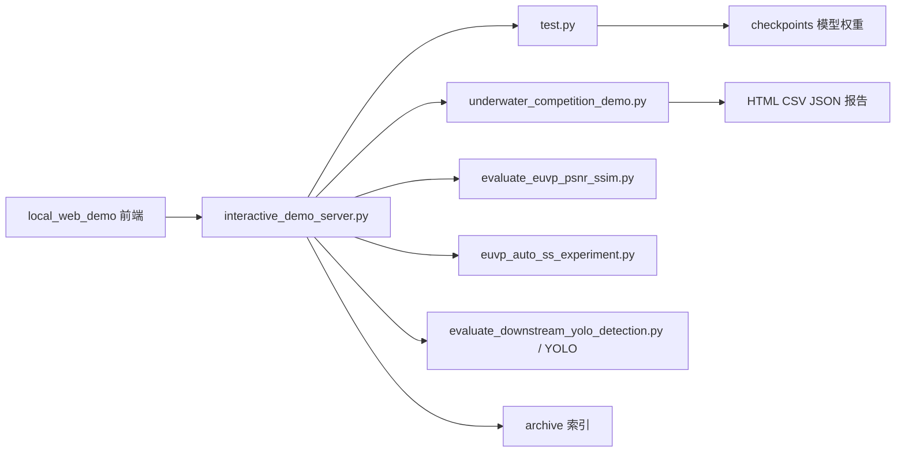
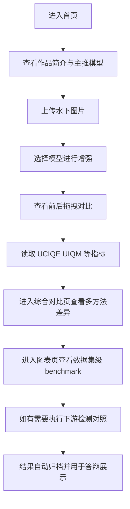

# 海眸智澈：面向水下机器人视觉任务的智能图像增强平台

## 第一章 需求分析

水下图像在采集过程中容易受到光吸收、散射和悬浮颗粒影响，普遍存在偏色、低对比、雾化和细节丢失等问题，直接影响水下机器人巡检、海洋生态监测、目标识别与后续视觉分析的准确性。为解决“图像可看但不可用”的实际痛点，本项目以水下图像增强为核心，构建面向竞赛展示和工程验证的一体化系统。

本作品面向三类用户：一是需要进行成果展示与答辩的参赛团队，二是需要对水下图像进行预处理的科研和工程人员，三是希望直观查看增强效果与指标变化的教师、评委与观众。系统主要功能包括：单图增强、传统方法与深度学习方法对比、指标自动评测、案例归档、图表展示和本地交互式演示。性能目标是本地部署方便、交互响应稳定、实验结果可复现、展示链路完整。

从对标角度看，当前同类方案通常分为传统增强工具和研究型水下增强模型两类。前者实现简单，但对复杂水下退化场景适应性有限；后者更强调算法精度，但往往缺少完整的人机交互和答辩展示能力。本作品重点对标“传统方法 + 原始 CycleGAN + 改进模型”的完整对照链，并进一步补齐展示层、归档层和评测层。

### 竞品分析表

| 对比维度 | 传统增强方法 | 研究型增强模型 | 本作品 |
| --- | --- | --- | --- |
| 代表方案 | Gray World、CLAHE、Gamma | 原始 CycleGAN、同类水下增强模型 | 改进 CycleGAN + 本地交互演示系统 |
| 水下场景针对性 | 一般 | 强 | 强 |
| 增强效果 | 基础改善 | 较好 | 较好且可解释 |
| 多方案对比 | 弱 | 一般 | 强 |
| 指标自动评测 | 弱 | 一般 | 强 |
| 可视化展示 | 弱 | 弱 | 强 |
| 竞赛答辩适配 | 弱 | 一般 | 强 |
| 部署方式 | 单机工具 | 研究代码 | 本地 Web 系统 |

### 主要功能与主要性能

| 类别 | 内容 |
| --- | --- |
| 主要功能 | 图像增强、模型切换、方法对比、自动报告、图表展示、结果归档、检测联动 |
| 主要性能 | 本地部署简单、单图增强稳定、结果可量化、页面适合答辩展示 |
| 面向用户 | 参赛团队、科研人员、评委、演示观众 |

---

## 第二章 概要设计

本作品采用“前端展示层 + Python 服务层 + 模型推理层 + 结果归档层”的总体结构，在保留 CycleGAN 训练测试主干的基础上，增加了适合竞赛展示的交互式应用能力。

### 2.1 功能模块图

```mermaid
graph TD
    A[前端展示层] --> A1[首页与封面展示]
    A --> A2[智能增强页]
    A --> A3[综合对比页]
    A --> A4[Benchmark 图表页]
    A --> A5[结果归档页]
    A --> A6[演示流程页]

    B[服务接口层] --> B1[/api/bootstrap]
    B --> B2[/api/enhance]
    B --> B3[/api/compare]
    B --> B4[/api/detect_compare]
    B --> B5[/api/archive]

    C[算法与评测层] --> C1[CycleGAN 基线]
    C --> C2[改进模型 MPCGAN]
    C --> C3[传统方法基线]
    C --> C4[UCIQE UIQM PSNR SSIM]
    C --> C5[YOLO 下游检测]

    D[数据与文件层] --> D1[checkpoints]
    D --> D2[results]
    D --> D3[local_web_demo runtime]
    D --> D4[archive entries.json]
```

### 2.2 模块层次与调用关系



### 2.3 人机界面设计概述

- 首页：展示项目定位、成果卡片、主推模型、应用场景和答辩入口。
- 智能增强页：支持上传图片、选择模型、前后拖拽对比、生成报告和导出结果。
- 综合对比页：统一展示传统方法、原始 CycleGAN、改进模型的横向结果。
- 图表页：展示 EUVP、UIEB 数据集上的客观指标对比。
- 归档页：管理历史案例，支持标签筛选、排序和重点案例展示。
- 演示流程页：串联答辩顺序，便于现场路演和讲解。

---

## 第三章 详细设计

### 3.1 界面设计

系统界面采用深色科技风，突出“产品化、可展示、可信度”三项特征。首页通过封面主图、成果卡片和动态标题提升第一视觉冲击；增强页提供上传、拖拽对比、指标卡片与下载入口；对比页突出“传统方法 - 基线模型 - 改进模型”的演进逻辑；归档页采用案例后台风格，强化作品沉淀能力；图表页和演示流程页则分别对应数据支撑和答辩节奏控制。

### 3.2 典型使用流程



### 3.3 数据库设计

本项目不使用传统数据库，而采用轻量级文件化存储方案。主要原因是系统当前以单机演示和竞赛部署为主，使用 `JSON + HTML + CSV` 的方式更易迁移、调试和展示。

#### 归档索引设计

| 字段名 | 含义 | 说明 |
| --- | --- | --- |
| id | 记录编号 | 唯一标识一次增强或对比任务 |
| type | 案例类型 | `enhance`、`compare`、`detect` 等 |
| title | 案例标题 | 展示在归档页的标题 |
| created_at | 生成时间 | 便于排序与追踪 |
| model_label | 模型名称 | 如“改进模型 MPCGAN” |
| summary | 摘要 | 简述指标变化或检测变化 |
| input_url | 原图地址 | 用于归档回放 |
| cover_url | 封面图地址 | 用于列表展示 |
| report_url | 报告入口 | 指向自动生成的 HTML 报告 |
| metrics_url | 指标文件 | 指向 `CSV` 或 `JSON` 明细 |
| tags | 标签 | 标记案例类别与模型身份 |

### 3.4 关键算法与技术设计

#### 1. 改进型 CycleGAN

项目以 CycleGAN 为基础模型，生成器采用 `resnet_9blocks`，判别器采用 PatchGAN。为了提升水下图像增强中的颜色恢复、结构保持和感知自然度，在原始对抗损失、循环一致性损失和身份损失基础上，引入了自定义监督项：

- 颜色一致性损失：约束生成图像与输入图像的颜色统计差异，缓解偏色问题。
- 结构保持损失：基于图像梯度差异约束边缘与纹理，避免过度平滑。
- 感知损失：使用 VGG16 中间层特征提升主观视觉质量。
- 灰世界损失：作为可选项抑制颜色漂移。

#### 2. 多方法统一对照

系统内置 `Gray World`、`CLAHE`、`Gray World + CLAHE`、`Gamma` 等传统方法，同时保留原始 CycleGAN 基线和改进模型，实现同图多方案对比，便于论证改进策略的必要性。

#### 3. 自动评测技术

项目支持无参考指标 `UCIQE`、`UIQM`，在存在参考图时还支持 `PSNR`、`SSIM`。评测脚本对输入图、输出图和参考图进行自动匹配，输出 `CSV` 和 `JSON`，既适合论文整理，也适合答辩展示。

#### 4. 下游任务联动验证

为证明增强结果不仅“更好看”，还“更可用”，项目加入了基于 YOLO 的下游目标检测对照模块，对比原图与增强图上的检测结果变化，体现增强对视觉任务可用性的提升。

---

## 第四章 测试报告

### 4.1 主要测试内容

| 测试项 | 测试内容 | 结果 |
| --- | --- | --- |
| 首页加载测试 | 检查封面区、成果卡片、导航入口是否正常显示 | 通过 |
| 智能增强测试 | 上传图片、选择模型、生成增强结果与自动报告 | 通过 |
| 综合对比测试 | 传统方法、原始 CycleGAN、改进模型三者对比是否正常 | 通过 |
| 图表展示测试 | Benchmark 数据是否正确读取并完成图表渲染 | 通过 |
| 归档功能测试 | 案例是否自动入档并可在归档页回看 | 通过 |
| 检测对照测试 | 原图与增强图的检测结果是否可视化展示 | 通过 |
| 演示流程测试 | 多页面串联展示是否流畅 | 通过 |

### 4.2 关键实验指标

根据项目已有 benchmark 结果，可形成如下主要技术指标：

| 数据集 / 模型 | PSNR | SSIM | UCIQE | UIQM |
| --- | ---: | ---: | ---: | ---: |
| EUVP - 原始 CycleGAN (`euvp_cyclegan_full`, 200) | 22.8155 | 0.7833 | 25.9335 | 5.3362 |
| EUVP - 改进模型 (`euvp_mpcgan_stage2_s0`, 202) | 22.9074 | 0.7946 | 25.8164 | 5.4069 |
| UIEB - 原始 CycleGAN (`euvp_cyclegan_full`, 200) | 17.8397 | 0.6261 | 23.2519 | 10.4775 |
| UIEB - 改进模型 (`euvp_mpcgan_stage2_s0`, 202) | 17.5409 | 0.6242 | 22.4599 | 10.5018 |

说明：EUVP 结果体现了改进模型在主数据集上的综合提升；UIEB 结果体现了模型跨数据集泛化能力，并为后续域适配和进一步优化提供依据。

### 4.3 技术指标总结

| 指标维度 | 结论 |
| --- | --- |
| 运行速度 | 单图增强流程满足本地答辩与演示需要 |
| 可用性 | 支持上传、增强、对比、报告导出、案例归档 |
| 扩展性 | 可继续增加更多模型、更多传统方法和更多图表 |
| 部署方便性 | 采用本地 Python 服务与静态前端，部署门槛较低 |
| 安全性 | 当前为本地单机演示系统，不涉及公网数据持久化 |

### 4.4 修正过程简述

在测试过程中，项目重点对前端交互联动、结果归档逻辑、模型切换、报告生成和检测对照链路进行了多轮修正，最终形成了“上传 - 增强 - 对比 - 评测 - 归档 - 展示”的稳定闭环。

---

## 第五章 安装及使用

### 5.1 安装环境要求

| 项目 | 要求 |
| --- | --- |
| 操作系统 | Windows |
| Python | 3.11 左右 |
| 深度学习框架 | PyTorch |
| 关键依赖 | OpenCV、NumPy、TorchVision、Ultralytics |
| 运行方式 | 本地 Python 环境 + 浏览器 |
| 模型文件 | 已训练好的 `checkpoints` 权重 |

### 5.2 默认安装与启动过程

1. 配置 Python 与 PyTorch 运行环境。  
2. 准备项目所需数据集与模型权重。  
3. 进入项目仓库目录。  
4. 启动交互式本地演示服务。

```powershell
.\scripts\launch_interactive_demo.ps1 -BindHost 127.0.0.1 -Port 8877 -GpuIds -1
```

启动后可在浏览器中访问本地页面，进入首页、增强页、对比页、图表页和归档页。

### 5.3 典型使用流程

1. 打开首页，了解项目背景与主推模型。  
2. 进入“智能增强演示”页面并上传一张水下图像。  
3. 选择模型执行增强，查看拖拽对比与指标卡片。  
4. 如需展示技术演进，进入“综合对比页”查看传统方法、基线模型与改进模型差异。  
5. 如需展示量化结果，打开图表页查看数据集级 benchmark。  
6. 如需展示任务价值，运行检测对照查看增强前后检测结果变化。  
7. 在归档页回看历史案例，支持答辩现场快速切换展示。  

### 5.4 批量报告生成方式

若需要直接生成单图或批量图像的 HTML 报告，可使用：

```powershell
.\scripts\launch_competition_demo.ps1 `
  -InputPath "<图片或文件夹路径>" `
  -CheckpointName "euvp_cyclegan_full" `
  -Epoch "latest" `
  -GpuIds "-1" `
  -Overwrite
```

系统默认输出 `index.html`、`metrics.csv` 和 `summary.json`，可直接用于成果整理与展示。

---

## 第六章 项目总结

本项目最大的特点，是完成了从“研究型算法代码”到“竞赛级系统作品”的升级。项目不仅关注水下图像增强效果本身，还进一步补齐了交互展示、报告生成、结果归档、图表分析和下游检测验证等能力，使作品具备更完整的工程表达与答辩说服力。

在开发过程中，主要难点包括：如何在无配对训练框架上引入适合水下场景的改进约束，如何将传统方法、基线模型和改进模型统一纳入同一展示链，如何把实验数据转化为评委易理解的图表和案例，以及如何在本地环境下实现较低门槛的部署。围绕这些问题，项目逐步形成了“算法层、评测层、展示层、归档层”四位一体的结构。

项目带来的提升主要体现在三个方面：一是图像增强效果和可解释性得到提升；二是系统整合、前后端协同和工程组织能力得到锻炼；三是作品在竞赛展示、成果汇报和后续拓展方面具备更强基础。后续可继续围绕视频增强、实时推理、多数据集对比、更多下游任务联动和案例管理平台化进行升级，从而进一步提升系统稳定性、可迁移性与应用价值。
